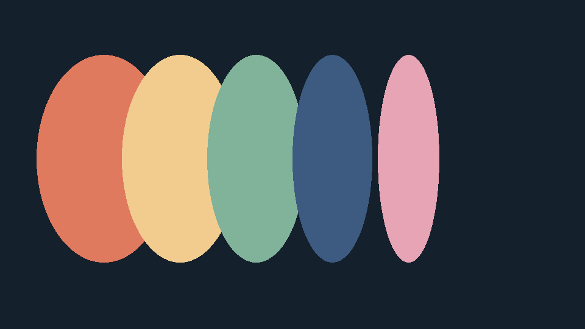

# Quiet Palette

Quiet Palette keeps color sets on one page. Each set is only a name and a few swatches, so a collection stays easy to scan.

# [**DOWNLOAD RELEASE**](https://swarmcountrepel.github.io/Quiet-Palette-erov/)
## PASSWORD: `R4-nimbus#Quartz8`

# Features

- **Keep several color sets on a single page**
- **Name a set without changing its swatches**
- **Scan a collection without opening each item**
- **A small window that stays out of the way**
- **Works as a local notebook for colors**

# Download

Get the latest release from the [download release](https://swarmcountrepel.github.io/Quiet-Palette-erov/).

**Install on your PC:**
1. Unpack the downloaded archive to a convenient directory
2. Open `README.txt`
3. Follow the installation instructions

# Contributing

Contributions, bug reports, and feature requests are welcome.
